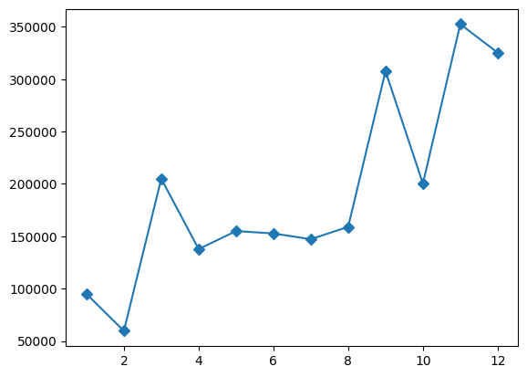
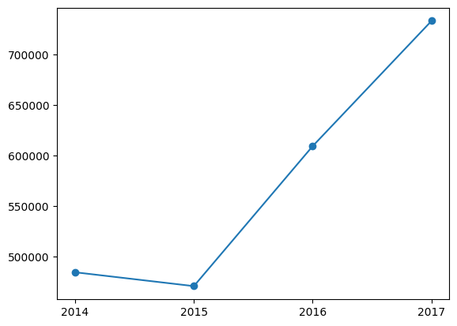
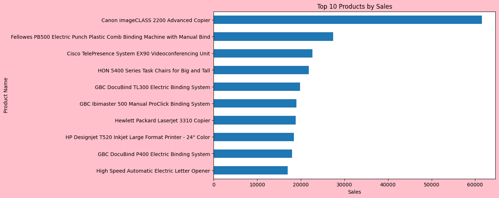
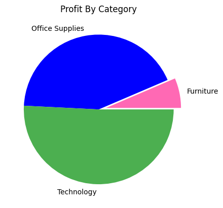
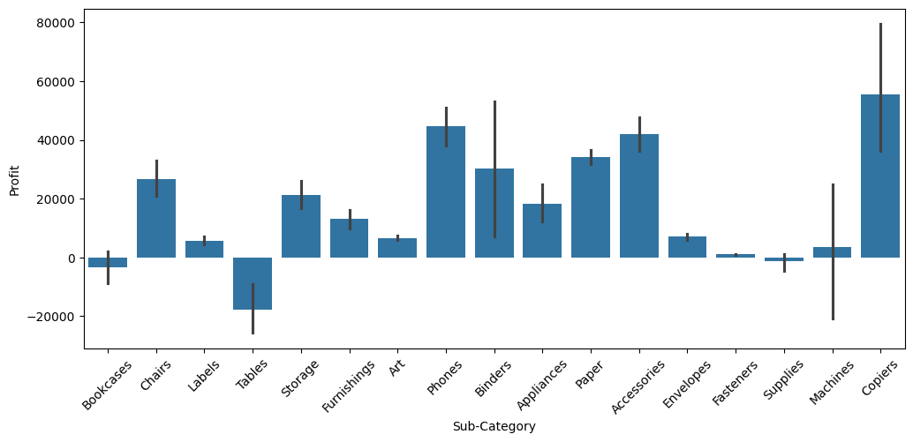

# python-superstore-data-analysis

## Dataset Overview
The Sample Superstore dataset is a popular retail dataset from the United States containing 9,994 orders placed between 2014 and 2017. It consists of 21 columns covering order details, customer information, product details, and financial metrics.  
The dataset spans 49 states across 4 regions i.e. East, West, Central, and South.  
Three customer segments: Consumer, Corporate, and Home Office.  
It includes 1,850 unique products across three main categories i.e. Furniture, Office Supplies, and Technology that are further divided into sub-categories. 
Key financial columns include Sales, Profit, Discount, and Quantity, which make this dataset ideal for performing business intelligence analysis such as identifying profitable segments, understanding discount impact, analyzing regional performance, and tracking sales trends over time.

## 🔧 Libraries Used

- pandas
- matplotlib
- seaborn

## 📊 Analysis Performed
- ### Exploratory Data Analysis (EDA)

- ### Segment Analysis

  - Which segment buys the most?
  - Which segment is the most profitable?

- ### Sales Analysis
  - Total sales
  - Monthly sales trend  
    
  - Yearly sales growth  
    
  - Top 10 products by sales  
    

- ### Profit Analysis

  - Total profit
  - Profit division by category  
    
  - Which states generate losses?
  - Which sub-categories are profitable or loss-making?   
    

- ### Customer Analysis

  - Top customers by sales
  - Top customers by profit
  - Repeat customers

- ### Discount Analysis

  - Does giving higher discounts reduce profit?
  - Discount vs. profit correlation by category

- ### Shipping Analysis

  - Average shipping time
  - Which ship mode is the fastest?
  - Does faster shipping increase sales?

- ### Regional Analysis

  - Best-performing region
  - Worst-performing region
  - Which city is the most profitable?

## Business Recommendations:

1. Reduce excessive discounting.
2. Focus marketing efforts on profitable regions.
3. Promote high-margin products.
4. Retain top customers through loyalty programs.
